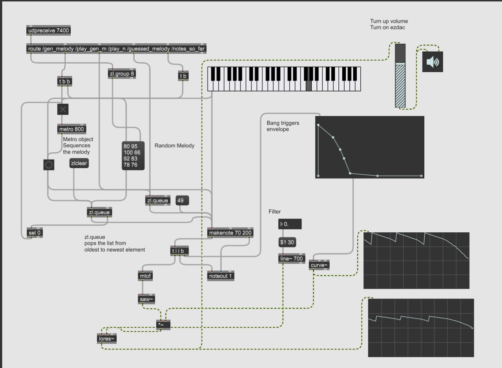

# Melody Guesser

A processing UI combined with MAX/MSP for handling real time audio.
A melody is generated within the E major scale. The game allows the player to audition the entire
melody 5 times. The player has 4 options out of which only 1 is correct for each note in the melody.
When the ‘Start Game’ button is clicked a melody is generated and the game loop begins. The
player has 3 lives to guess the correct next note. Lives reset each time the player gets a correct
note. The player can audition the melody that they have guessed, how many ever times they want.

## Instructions:

1. Click Start Game, Melody gets generated, and game loop begins.
2. Click Play Full Melody to audition the entire generated melody. Make notes if you want to,
   you only get 5 turns.
3. Guess the first note and so on by auditioning the 4 options on the bottom of the screen.
4. Click Lock In to lock in your guess. Be careful, you only have 3 lives for each guess.

## Features
- 4 buttons to audition notes
- An input microphone button

## _processing_

Processing handles most of the game logic. It makes handling a loop very convenient. In this case
there were three main classes, A Button class, Rectangle class, and a MessageHandler class.
These classes are used in conjunction with other helper functions to implement the design. To be
concise, the logic consists of a trigger from the mouse, evaluation with conditional statements, and
sending messages over UDP to Max using the oscp5 library.

## MAX/MSP

Handles the logic for playing audio. It converts the midi integers to frequencies. The frequencies are
used to combine a regular grand piano with a saw waveform with filtering. This creates a unique
sound. As Far as the OSC messages, Max receives a set of messages containing integer values. The
messages are then routed through the ‘route’ object.

## Game Design:

The goal of this game is to both challenge the player as well as strengthen our pitch detection.
People with perfect pitch perhaps be able to memorize the pattern easily. Can the rest of us who do
not have perfect pitch level up? The DGD1 type this game caters to is most likely Conqueror.

## Good Luck.
